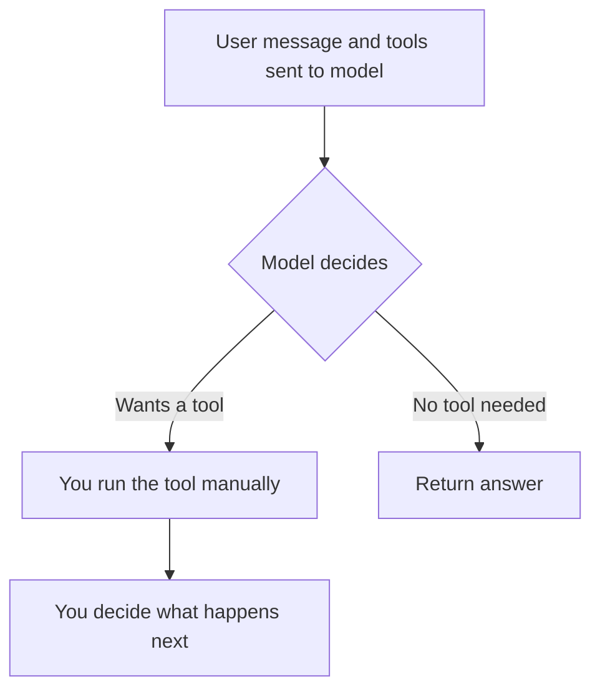
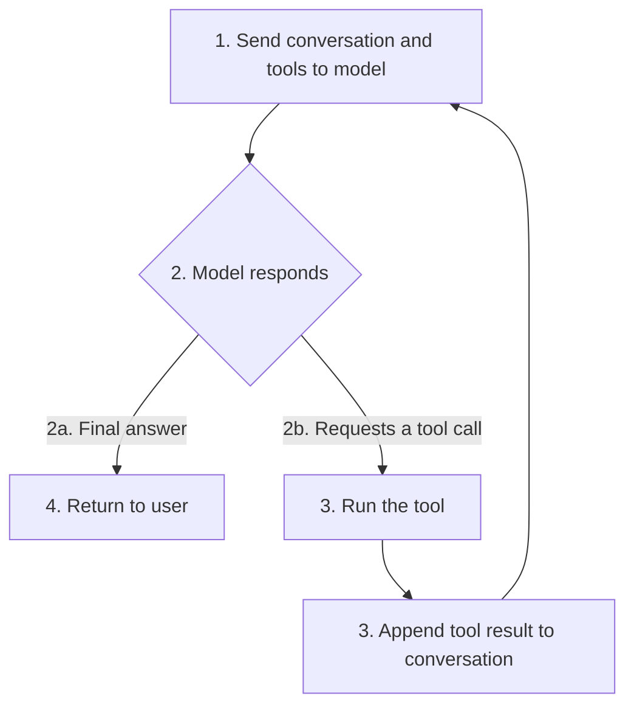
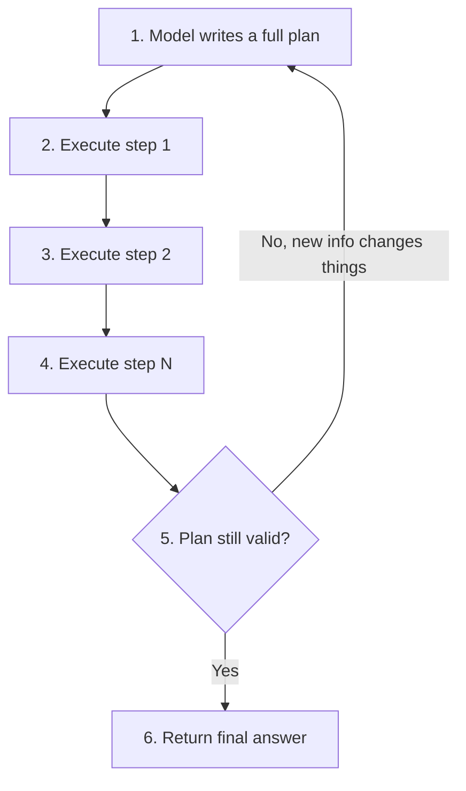
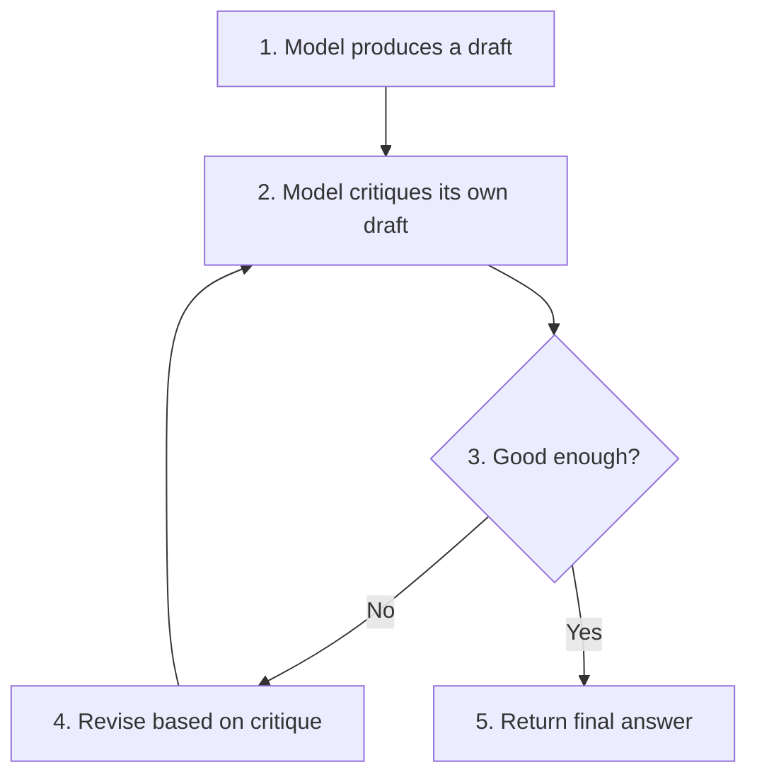
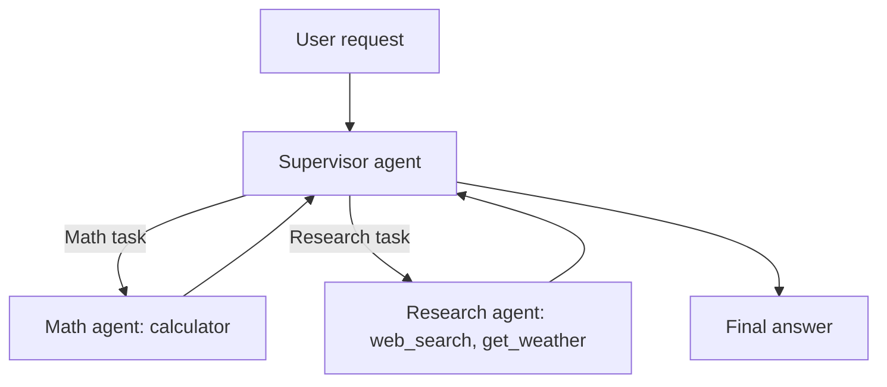

# Agentic Patterns: A Practical Guide

A breakdown of five ways to structure how an LLM plans and executes
actions using tools, from the simplest (one tool call, you control
the rest) to the most complex (several specialized agents coordinated
by a supervisor). Each pattern links to a runnable example in this
repository.

## Table of Contents

1. [What "agentic" means here](#what-agentic-means-here)
2. [Pattern comparison at a glance](#pattern-comparison-at-a-glance)
3. [1. Simple Tool-Calling](#1-simple-tool-calling)
4. [2. ReAct](#2-react)
5. [3. Plan-and-Execute](#3-plan-and-execute)
6. [4. Reflection](#4-reflection)
7. [5. Multi-Agent (Supervisor)](#5-multi-agent-supervisor)
8. [Choosing a pattern](#choosing-a-pattern)
9. [LangChain vs LangGraph](#langchain-vs-langgraph)

## What "agentic" means here

An agent, in this context, is not a new kind of model. It is a loop
built around a regular LLM call. The model never runs code itself, it
outputs structured text saying "call this tool with these arguments."
The agent is the harness that actually executes that function, in
Python, and feeds the result back in.

## Pattern comparison at a glance

| Pattern | Use when | Main trade-off |
|---|---|---|
| Simple Tool-Calling | One predictable tool call, you control the flow after | No multi-step reasoning at all |
| ReAct | Open-ended requests, unknown number or order of tool calls | Less predictable cost and latency |
| Plan-and-Execute | Known multi-step workflow, efficiency or a reviewable plan matters | Less adaptive mid-task without extra re-planning logic |
| Reflection | Output quality matters more than speed | At least doubles cost and latency per task |
| Multi-Agent | Toolset or domain has grown too large for one prompt | More moving parts, routing mistakes are a new failure mode |

## 1. Simple Tool-Calling

The model gets one chance to decide whether to call a tool. Your code
catches that decision and controls exactly what happens next. There
is no automatic loop back to the model unless you write that step
yourself.



**Advantages:** fully predictable, cheapest option, easiest to debug.

**Disadvantages:** no multi-step reasoning, does not scale as more
tools are added, cannot recover if one tool call is not enough.

Code: [`01_simple_tool_calling/main.py`](../01_simple_tool_calling/main.py)

```python
model_with_tools = model.bind_tools([calculator])
response = model_with_tools.invoke(messages)
if response.tool_calls:
    result = calculator.invoke(response.tool_calls[0]["args"])
```

## 2. ReAct

Reason, act, observe, repeat, until the model has a final answer.
This is the general-purpose default for "let the model figure out
which tools to use and in what order."



**Advantages:** flexible, simple to implement, self-correcting across
loop iterations.

**Disadvantages:** can be inefficient (re-reasons from scratch each
step), cost and latency vary per request, needs a `recursion_limit`
as a safety net against runaway loops.

Code: [`02_react_agent/main.py`](../02_react_agent/main.py)

```python
from langgraph.prebuilt import create_react_agent

agent = create_react_agent(model, tools, prompt=SYSTEM_PROMPT)
result = agent.invoke(
    {"messages": [{"role": "user", "content": user_message}]},
    config={"recursion_limit": 10},
)
```

## 3. Plan-and-Execute

The model commits to a full multi-step plan up front, then executes
each step, only re-planning if a step reveals something that
invalidates the rest.



**Advantages:** more efficient than ReAct for genuinely multi-step
tasks, the plan is a transparent artifact a user can review first,
predictable execution order.

**Disadvantages:** more code to write, less adaptive mid-task without
extra re-planning logic, overkill for simple or unpredictable
requests.

Code: [`03_plan_and_execute/main.py`](../03_plan_and_execute/main.py)

```python
from langgraph.graph import StateGraph, END

graph = StateGraph(PlanState)
graph.add_node("planner", planner)
graph.add_node("executor", executor)
graph.set_entry_point("planner")
graph.add_edge("planner", "executor")
graph.add_conditional_edges("executor", should_continue)
```

## 4. Reflection

The model drafts an answer, critiques its own draft, and revises if
the critique found problems, looping until it passes or hits a cap.



**Advantages:** meaningfully improves quality for tasks where first
drafts are unreliable, catches mistakes without a human in the loop,
composable on top of any other pattern.

**Disadvantages:** at least doubles cost and latency, needs its own
retry cap, the critique step is itself a model call and can be wrong
too.

Code: [`04_reflection/main.py`](../04_reflection/main.py)

```python
graph.add_node("draft", draft_node)
graph.add_node("critique", critique_node)
graph.add_node("revise", revise_node)
graph.add_conditional_edges("critique", route)  # route: END or "revise"
graph.add_edge("revise", "critique")
```

## 5. Multi-Agent (Supervisor)

A supervisor model routes each request to a specialized sub-agent,
each with its own narrow toolset and prompt, instead of one agent
juggling everything.



**Advantages:** each sub-agent stays focused and easier to tune,
scales better as tool count grows, sub-agents can even use different
models.

**Disadvantages:** more complex to build and maintain, extra latency
from the routing call, routing mistakes are a new failure mode,
overkill at small scale.

Code: [`05_multi_agent_supervisor/main.py`](../05_multi_agent_supervisor/main.py)

```python
math_agent = create_react_agent(model, [calculator], prompt="...")
research_agent = create_react_agent(model, [web_search, get_weather], prompt="...")
route = supervisor_route(task)  # "math" or "research"
result = AGENTS[route].invoke({"messages": [{"role": "user", "content": task}]})
```

## Choosing a pattern

Start with ReAct. It is the general-purpose default and covers most
assistant-style use cases. Move to another pattern only when you hit
a concrete pain point:

- Output quality is inconsistent on first pass: add **Reflection**.
- A request genuinely needs several tools in a known, efficient
  order, or you want the plan reviewable before it runs: use
  **Plan-and-Execute**.
- Your toolset has grown large enough that the model starts choosing
  the wrong tool, or one system prompt is trying to describe too
  much: split into **Multi-Agent**.
- You need full, deterministic control over a single, well-scoped
  action: drop down to **Simple Tool-Calling**.

## LangChain vs LangGraph

**LangChain** is the library of building blocks: model wrappers
(`init_chat_model`), the `@tool` decorator, message types, prompt
templates, retrievers. It is what you use to construct individual
pieces, a model, a tool, a message.

**LangGraph** is the orchestration layer built on top of those
pieces. It represents an application as a graph of nodes (steps) and
edges (transitions), with explicit state flowing through it.
`create_react_agent` is a pre-built LangGraph graph, the ReAct diagram
above is literally the graph it constructs and runs.

In practice: tools and model setup are LangChain. The loop, the
checkpointing and memory, the plan/execute or reflect/revise
structure, are LangGraph. When a pre-built agent like
`create_react_agent` is not enough, you drop to LangGraph's raw
`StateGraph` API directly, while still using your existing LangChain
tools and models inside the custom nodes.
